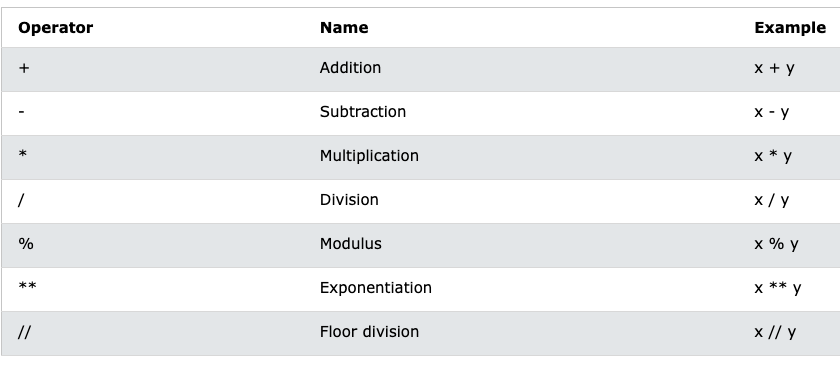
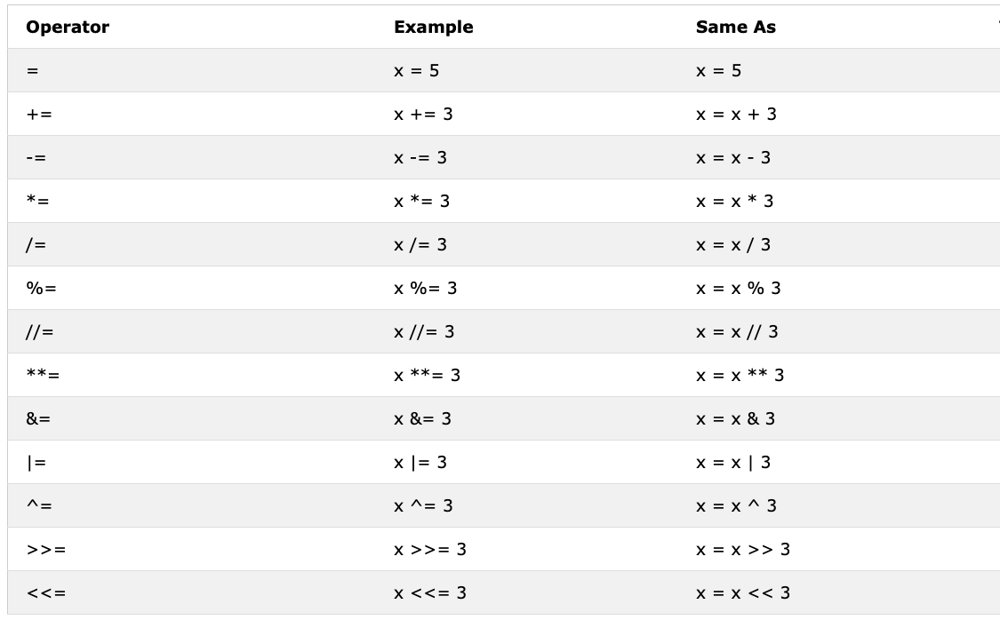
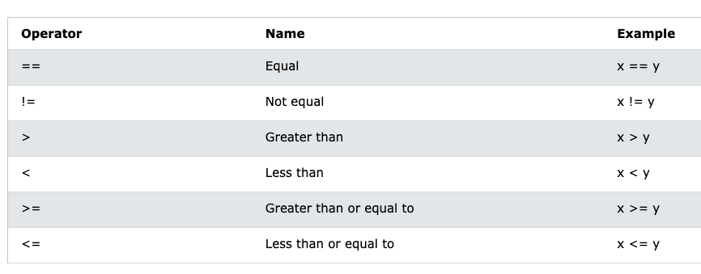
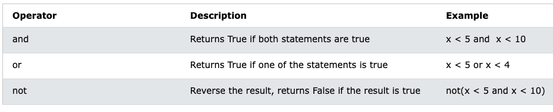
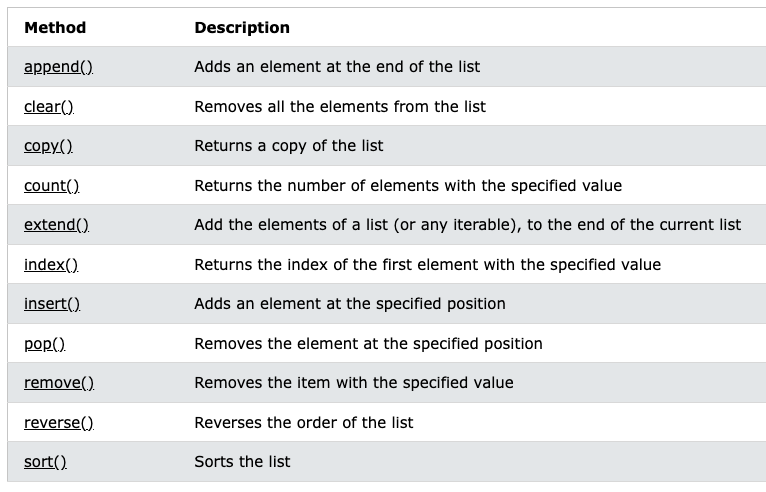

# Hello-Python

Este repositorio llevará mi aprendizaje en python

## Comentarios y hola mundo

Los comentarios es algo que todo programador debe de conocer ya que permitira dejar una pequeña descripcion de la funcionalidad que tendra una sección en especifico de nuestro codigo.

```
# Comentario de una linea

''' Comentario
de varias
lineas'''
```

> Todo string que no este asignado a una variable python lo toma como un comentario

## Tipos de Datos

Dentro de python tenemos diversos tipos de datos que vienen nativos con el lenguaje de programación.

Tipos numéricos - Tenemos 3 tipos de Datos numericos con los cuales podemos trabajar con python.

- int -> Llamados enteros, seran numeros sin coma decimal

```
1 2 3
```

- float -> Numeros flotantes, es decir con coma decimal

```
23.3 45.1
```

- complex -> Numeros complejos que se utilizaran en su mayoria de casos para temas estadisticos

```
3 +2j
```

Tipos caracteres - Los caracteres son cadenas de textos que podemos manipular.

- str -> String, tipo de texto al cual le podemos aplicar algunas funciones, las cuales se veran más adelante.

```
'Hola mundo'
"Hi wolrd"
```

Tipo de Secuencia - Son aquellos que pueden almacenar más de un elemento a la vez.

-lista-> list:Se utilizan para almacenar varios elementos en una sola variable

```
my_list =[1,2,4]
```

-tupla -> tuple: Son similares a las listas, pero a diferencia de las listas, son inmutables, es decir no pueden ser modificadas.

```
my_tuple = (1,4,24)
```

-rango -> range(): Representan una secuencia inmutable de numeros enteros. Utilizado comunmente para generar una secuencia de numeros enterios para su uso en un bucle for.

```
range(0,10,1) - numeros del 0 al 10 de 1 en 1
range(0,10) - numeros del 0 al 10 por defecto de 1 en 1
range(1,11,2) - numeros del 1 al 11 de 2 en 2
```

Tipos Booleanos

- bool -> Son aquellos que representan valores de verdad. Es decir Verdaderos o Falsos

```
True or False
```

Tipos de Mapeo

- diccionarios -> dict: Estructura de datos que permite almacenar un conjunto de datos como pares clave-valor, cada valor es accesible a través de una clave unica.

```
my_dict = {
    'nombre':'Juan',
    'edad':16,
    'ciudad':'Chiclayo'
}

print(my_dict['nombre'])
>>> Juan
```

Tipos de Conjunto

- set -> Coleccion de elementos unicos e inmutables; es decir, no debe haber duplicados en un conjunto y no se pueden cambiar despues de ser creados.

```
my_set = {1,3,4,}
set([1,3,4,3])
```

- frozenset -> Similares a los tipos de datos set, pero son inmutables

```
my_frozenset=frozenset([1,3,5,3])
```

Funcion **type()** permitira poder identificar el tipo de dato que tenemos

```
print(type(3)) -> int
print(type('hi')) -> str
```

## Variables

Una variable es un espacio reservado en memoria a la cual se le asignara un valor.
Python no tiene una palabra reservada para la creación de una variable, ni debemos especificar el tipo de dato que esta variable va a contener.

Reglas para la creación de variables:

- Un nombre de variable debe comenzar con una letra o el caracter de guión bajo.
- Un nombre de variable no puede comenzar con un número.
- Un nombre de variable solo puede contener caracteres alfanumericos y guiones bajos(Az,0-9 y \_)
- Los nombres de las variables distinguen entre mayusculas y minusculas.
- Un nombre de variable no puede ser ninguna de las palabras clave de python.

```
my_variable_entero=3
my_variable_bool=True
my_variable_float=3.5
```

### Casting de variable

En Python podemos forzar el cambio de una tipo de una variable, siempre y cuando la información lo permita.

```
my_variable_int_to_str =str(my_variable_entero)
print(type(my_variable_entero)) #Devuelve <class 'int'>
print(type(my_variable_int_to_str)) #Devuelve <class 'str'>
```

### Concatenación de variables

Podemos juntar variables de tipo str.

```
name_complet = first_name + ' ' + last_name
print(name_complet)
```

### Función reservada de python len()

La función reservada en el lenguaje de programación python tiene una función len(), la cual devolvera el numero de caracteres que un string tiene.

```
print(len(first_name))
```

### Asignación de variables en una sola linea

```
name, surname = 'Antony','Alarcon'
```

> Cuidado con abusar con esta sintaxis ya que puede generar problemas en el mantenimiento del aplicativo.

### Ingresar el valor por teclado

Con la función input() pedimos que el ingreso del valor se realice por teclado

```
nombre = input('Ingresa tu nombre: ')
print(f"Hola {nombre}")
```

> Cuando pedimos un valor con el metodo input() siempre se va a recibir un valor en tipo str.

## OPERADORES

Los operadores se utilizan para realizar operaciones sobre variables y valores.

- Adición(+) sumar dos valores

- Resta (-) restar dos valores

- Multiplicación (\*) multiplicar dos valores, tambien podemos multiplicar un string con un numero y lo que realizara es repetir el str las veces que el numero lo estipule.

- División (/) dividir dos valores

- Módulo (%) encontrar el residuo de dividir dos valores

- División exacta (//) muestra el cociente de la división, asi no sea exacta
- Exponenciación (\*\*) eleva a un exponente un numero.



- Operadores de asignación -> El operador de asignación es el signo = que lo utilizamos para asignar un valor a una variable.



- Operadores comparativos -> Permite realizar comparaciones entre 2 valores, esto devolvera un valor de True o False.



- Operadores lógicos -> Permite realizar comparaciones logicas entre 2 o mas valores, esto devolvera un valor de True o False



## Strings

Para definir una variable como un string la debemos definir de la siguiente manera.

```
my_string = "Mi String"
```

La forma de concatenar string es con el simbolo +

```
"Hola " + "Pedro"
```

### Formateo de String

Existen 3 formas de formatear string

```
print("Mi nombre es {} {} y mi edad es {:.1f}".format(my_name,my_lastname,my_age))
print("Mi nombre es %s %s y mi edad es %d" %(my_name,my_lastname,my_age))
print(f"Mi nombres es {my_name} {my_lastname} y mi edad es {my_age:.1f}")
```

Desempaquetado de caracteres

Nosotros podemos asignar a variables diferentes, los valores de un string.

```
language = "Python"
a,b,c,d,e,f = language
print(a,b,c,d,e,f)
```

División de un string

En programación, el conteo comienza desde cero. Por lo tanto, la primera letra de una cadena está en el índice cero y la última letra de una cadena es la longitud de una cadena menos uno.

```
language = 'Python'
first_three = language[0:3] # inicia del valor 0 hasta el 3 sin contar ese ultimo, es decir solo considerara hasta la posición 2
```

### Metodos de strings

- capitalize() -> convierte el primer caracter de la cadena en letra mayuscula.

```
challenge = 'thirty days of python'
print(challenge.capitalize()) #'Thrirty days of python'
```

- count() -> devuelve las ocurrencias de la subcadena en la cadena, count(subcadena,inicio=,fin=). El inicio es un indice inicial para el conteo y el fin es el ultimo indice para contar

```
print(challenge.count('y')) #imprimira 3, ya que 3 veces se repite
print(challenge.count('y',7,14)) # 1
print(challenge.count('th')) #2
```

- endswith() -> Comprueba si una cadena termina con una terminación especifica

```
print(challenge.endswith('on')) #True
print(challenge.endswith('tion')) #False
```

- expandtabs() -> reemplaza el caracter de tabulación con espacios, el tamaño de tabulacion predeterminado es 8. Toma el argumento de tamaño de tabulación

```
challenge = 'thirty\tdays\tof\tpython'
print(challenge.expandtabs())   # 'thirty  days    of      python'
print(challenge.expandtabs(10)) # 'thirty    days      of        python'
```

- find() -> Devuelve el indice de la primera aparición de una subcadena, si no encuentra devuelve -1.

```
print(challenge.find('y')) #5
print(challenge.find('th')) #0
```

-rfind() -> Devuelve el indice de la ultima aparición de una subcadena, si no se encuentra, devuelve -1

```
print(challenge.rfind('y'))  # 16
print(challenge.rfind('th')) # 17
```

- format() -> formatea la cadena para obtener una salida más agradable.

```
radius = 10
pi = 3.14
area = pi * radius ** 2
result = 'The area of a circle with radius {} is {}'.format(str(radius), str(area))
print(result) # The area of a circle with radius 10 is 314
```

- index() -> devuelve el indice más bajo de una subcadena; los argumentos adicionales indican el indice inicial y final(por defecto inicia en cero). Si no encuentra la subcadena, se genera un error de valor.

```
challenge = 'thirty days of python'
sub_string = 'da'
print(challenge.index(sub_string))  # 7
print(challenge.index(sub_string, 9)) # error
```

- rindex() -> Devuelve el indice más alto de una subcadena, los argumentos adicionales indican el indice inicial y final

```
challenge = 'thirty days of python'
sub_string = 'da'
print(challenge.rindex(sub_string))  # 7
print(challenge.rindex(sub_string, 9)) # error
print(challenge.rindex('on', 8)) # 19
```

- isalnum() -> Comprueba caracteres alfanumericos

```
challenge = 'ThirtyDaysPython'
print(challenge.isalnum()) # True

challenge = '30DaysPython'
print(challenge.isalnum()) # True

challenge = 'thirty days of python'
print(challenge.isalnum()) # False, space is not an alphanumeric character
```

- isalpha() -> Comprueba si todos los elementos de la cadena son caracteres alfabeticos (a-z y A-Z)

```
challenge = 'thirty days of python'
print(challenge.isalpha()) # False, space is once again excluded
challenge = 'ThirtyDaysPython'
print(challenge.isalpha()) # True
num = '123'
print(num.isalpha())      # False
```

- isdecimal() -> Comprueba si todos los caracteres de una cadena son decimal (0-9)

```
challenge = 'thirty days of python'
print(challenge.isdecimal())  # False
challenge = '123'
print(challenge.isdecimal())  # True
challenge = '\u00B2'
print(challenge.isdigit())   # False
challenge = '12 3'
print(challenge.isdecimal())  # False, space not allowed
```

- isdigit() -> Comprueba si todos los caracteres de una cadena son números (0-9 y algunos otros caracteres Unicode para numeros)

```
challenge = 'Thirty'
print(challenge.isdigit()) # False
challenge = '30'
print(challenge.isdigit())   # True
challenge = '\u00B2'
print(challenge.isdigit())   # True
```

- isnumeric() -> Comprueba si todos los caracteres de una cadena son números o están relacionados con números (al igual que isdigit(), solo que acepta más símbolos, como ½)

```
num = '10'
print(num.isnumeric()) # True
num = '\u00BD' # ½
print(num.isnumeric()) # True
num = '10.5'
print(num.isnumeric()) # False
```

- isidentifier() -> Comprueba si hay un identificador validor: comprueba si una cadena es un nombre de variable valido.

```
challenge = '30DaysOfPython'
print(challenge.isidentifier()) # False, because it starts with a number
challenge = 'thirty_days_of_python'
print(challenge.isidentifier()) # True
```

- islower() -> Comprueba si todos los caracteres del alfabeto en la cadena estan en minusculas.

```
challenge = 'thirty days of python'
print(challenge.islower()) # True
challenge = 'Thirty days of python'
print(challenge.islower()) # False
```

- isupper() -> comprueba si todos los caracteres del alfabeto en la cadena están en mayusculas.

```
challenge = 'thirty days of python'
print(challenge.isupper()) #  False
challenge = 'THIRTY DAYS OF PYTHON'
print(challenge.isupper()) # True
```

- join() -> Devuelve una cadena concatenada.

```
web_tech = ['HTML', 'CSS', 'JavaScript', 'React']
result = ' '.join(web_tech)
print(result) # 'HTML CSS JavaScript React'

web_tech = ['HTML', 'CSS', 'JavaScript', 'React']
result = '# '.join(web_tech)
print(result) # 'HTML# CSS# JavaScript# React'
```

- strip() -> elimina todos los caracteres dados comenzando deesde el principio y el final de la cadena.

```
challenge = 'thirty days of pythoonnn'
print(challenge.strip('noth')) # 'irty days of py'
```

- replace() -> Reemplaza la subcadena con una cadena dada.

```
challenge = 'thirty days of python'
print(challenge.replace('python', 'coding')) # 'thirty days of coding'
```

- split() -> Divide la cadena, utilizando la cadena dada o el espacio como separador

```
challenge = 'thirty days of python'
print(challenge.split()) # ['thirty', 'days', 'of', 'python']
challenge = 'thirty, days, of, python'
print(challenge.split(', ')) # ['thirty', 'days', 'of', 'python']
```

- title() -> Devuelve una cadena con titulo en mayusculas y minusculas.

```
challenge = 'thirty days of python'
print(challenge.title()) # Thirty Days Of Python
```

- swapcase() -> Convierte todos los caracteres en mayúsculas en minúsculas y todos los caracteres en minúsculas en mayúsculas.

```
challenge = 'thirty days of python'
print(challenge.swapcase())   # THIRTY DAYS OF PYTHON
challenge = 'Thirty Days Of Python'
print(challenge.swapcase())  # tHIRTY dAYS oF pYTHON
```

- startswith() -> Comprueba si la cadena comienza con la cadena especificada.

```
challenge = 'thirty days of python'
print(challenge.startswith('thirty')) # True

challenge = '30 days of python'
print(challenge.startswith('thirty')) # False
```

## Listas

Las listas se utilizan para almacenar varios elementos en una sola variable.
Las listas son uno de los cuatro tipos de datos integrados en Python que se utilizan para almacenar colecciones de datos; los otros tre son Tuple, Set y Dictionary.

```
my_list = ["aple","banana","cherry"]
my_other_list = [25, 1.56, "Antony"]
```

> Podemos tener diferentes de tipos de datos en una lista.

### Acceder a elementos

Los elementos de la lista están indexados y puedes acceder a ellos consultando el numero de indice.

```
my_list = ["apple","banana","cherry"]
print(my_list[1]) #Imprimira el valor en el indice 1
```

Indexación negativa -> La indexación negativa significa empezar desde el final, donde -1 se refiere al ultimo elemento, -2 se refiere al penultimo elemento, etc.

```
print(my_list[-1])
```

Rango de indices -> Se puede especificar un rango de indices especificando donde comenzar y donde finalizar el rango. Esto devolvera una nueva lista con los elementos especificados.

```
print(my_list[2:5])
```

> La búsqueda comenzará en el índice 2 (incluido) y finalizará en el índice 5 (no incluido).

Comprobar si el valor existe

Para determinar si un elemento especifico esta presente en una lista, utilice la **in** palabra clave.

```
thislist = ["apple", "banana", "cherry"]
if "apple" in thislist:
  print("Yes, 'apple' is in the fruits list")
```

### Cambiar el valor del articulo

Ya que una list es variable, nosotros podriamos cambiar el valor de un elemento especifico.

```
thislist = ["apple", "banana", "cherry"]
thislist[1] = "blackcurrant"
print(thislist)
```

Cambiar un rango de valores de elementos -> Para cambiar un rango de valores de elementos, debemos definir una lista con los nuevos valores y hacer referencia al rango de numeros de indice donde desea insertar los nuevos valores.

```
thislist = ["apple", "banana", "cherry", "orange", "kiwi", "mango"]
thislist[1:3] = ["blackcurrant", "watermelon"]
print(thislist)
```

> Si inserta más elementos de los que reemplaza, los nuevos elementos se insertarán donde especificó y los elementos restantes se moverán en consecuencia:

```
thislist = ["apple", "banana", "cherry"]
thislist[1:2] = ["blackcurrant", "watermelon"]
print(thislist)

thislist = ["apple", "banana", "cherry"]
thislist[1:3] = ["watermelon"]
print(thislist)
```

Insertar elementos -> Para insertar un nuevo elemento de la lista, sin reemplazar ninguno de los valores existentes, podemos utilizar el **insert()** metodo.

```
thislist = ["apple", "banana", "cherry"]
thislist.insert(2, "watermelon") # indicamos el indice y el valor
print(thislist)
```

### Añadir elementos

Para agregar un elemento al final de la lista, utilice el metodo **append()**

```
thislist = ["apple", "banana", "cherry"]
thislist.append("orange")
print(thislist)
```

Para insertar un elemento de lista en un indice especificado, utilice el **insert()** metodo.

```
thislist = ["apple", "banana", "cherry"]
thislist.insert(1, "orange")
print(thislist)
```

Ampliar una lista

Para agregar elementos de otra lista a la lista actual, utilice el **extend()** metodo.

```
thislist = ["apple", "banana", "cherry"]
tropical = ["mango", "pineapple", "papaya"]
thislist.extend(tropical)
print(thislist)
```

> Con el metodo **extend()** puede agregar cualquier otro objeto iterable (tuplas,conjuntos, diccionarios,etc.)

```
thislist = ["apple", "banana", "cherry"]
thistuple = ("kiwi", "orange")
thislist.extend(thistuple)
print(thislist)
```

### Elimina elementos de la lista

El metodo **remove()** elimina el elemento especificado

```
thislist = ["apple", "banana", "cherry"]
thislist.remove("banana")
print(thislist)
```

> Si hay más de un elemento con el valor especificado, el remove()método elimina la primera aparición:

Eliminar indice especificado

El metodo **pop()** elimina el indice especificado

```
thislist = ["apple", "banana", "cherry"]
thislist.pop(1)
print(thislist)
```

> Si no especifica el índice, el pop()método elimina el último elemento.

La palabra **del** tambien elimina el indice especificado

```
thislist = ["apple", "banana", "cherry"]
del thislist[0]
print(thislist)
```

> La delpalabra clave también puede eliminar la lista por completo.

```
thislist = ["apple", "banana", "cherry"]
del thislist
print(thislist) #this will cause an error because you have succsesfully deleted "thislist".
```

Limpiar la lista

El metodo **clear()** vacia la lista

```
thislist = ["apple", "banana", "cherry"]
thislist.clear()
print(thislist) #vacia
```

### Recorrer una lista en bucle

Se puede recorrer los elementos de la lista mediante un **for** bucle

```
thislist = ["apple", "banana", "cherry"]
for x in thislist:
  print(x)
```

Tambien podemos hacerlo consultando el numero de indice.

```
thislist = ["apple", "banana", "cherry"]
for i in range(len(thislist)):
  print(thislist[i])
```

Mediante comprensión de listas

```
thislist = ["apple", "banana", "cherry"]
[print(x) for x in thislist]
```

### Comprensión de listas - List comprehension

La List Comprehension ofrece una sintaxis más corta cuando desea crear una nueva lista basada en los valores de una lista existente.

Ejemplo: A partir de una lista de frutas, desea una nueva lista que contenga solo las frutas con la letra "a" en el nombre

```
fruits = ["apple", "banana", "cherry", "kiwi", "mango"]
newlist = []

for x in fruits:
  if "a" in x:
    newlist.append(x)

print(newlist)
```

Mediante compresión seria

```
fruits = ["apple", "banana", "cherry", "kiwi", "mango"]

newlist = [x for x in fruits if "a" in x]

print(newlist)
```

Sintaxis

```
newlist = [expression for item in iterable if condition == True]
```

Condicion

La condición es como un filtro que sólo acepta los artículos que valen **True**.

```
newlist = [x for x in fruits if x != "apple"]
```

> La condición if x != "apple" regresará Truepara todos los elementos excepto "manzana", lo que hará que la nueva lista contenga todas las frutas excepto "manzana".

Expresión

La expresión es el elemento actual en la iteración, pero también es el resultado, que puedes manipular antes de que termine como un elemento de lista en la nueva lista:

```
newlist = [x.upper() for x in fruits]
```

### Ordenas lista

Alfanumerica

Los objetos de lista tienen un **sort()** metodo que ordenara la lista alfanumericamente, en orden ascendete, de forma predeterminada.

```
thislist = ["orange", "mango", "kiwi", "pineapple", "banana"]
thislist.sort()
print(thislist)

thislist = [100, 50, 65, 82, 23]
thislist.sort()
print(thislist)
```

Ordernar de forma descendente

```
thislist = ["orange", "mango", "kiwi", "pineapple", "banana"]
thislist.sort(reverse = True)
print(thislist)
```

Personalizar la función de clasficación

Tambien puedes personalizar tu propia función utilizando la palabra clave argumento **key = function**

```
def myfunc(n):
  return abs(n - 50)

thislist = [100, 50, 65, 82, 23]
thislist.sort(key = myfunc)
print(thislist)
```

> De forma predeterminada, el sort()método distingue entre mayúsculas y minúsculas, lo que da como resultado que todas las letras mayúsculas se ordenen antes que las minúsculas:

> Afortunadamente, podemos utilizar funciones integradas como funciones clave al ordenar una lista.

> Entonces, si desea una función de ordenamiento que no distinga entre mayúsculas y minúsculas, utilice str.lower como función clave:

```
thislist = ["banana", "Orange", "Kiwi", "cherry"]
thislist.sort(key = str.lower)
print(thislist)
```

Orden inverso

¿Qué pasa si quieres invertir el orden de una lista, independientemente del alfabeto?

El **reverse()** método invierte el orden de clasificación actual de los elementos.

```
thislist = ["banana", "Orange", "Kiwi", "cherry"]
thislist.reverse()
print(thislist)
```

### Metodos de lista


